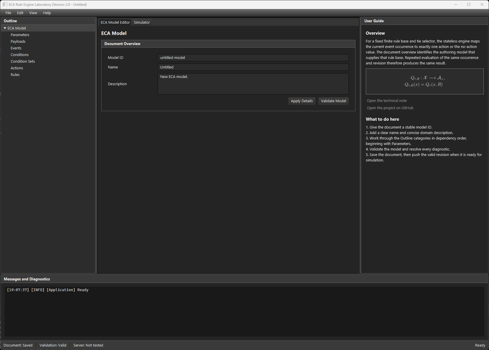
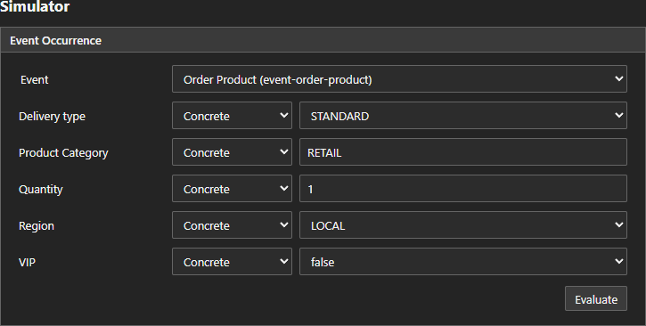
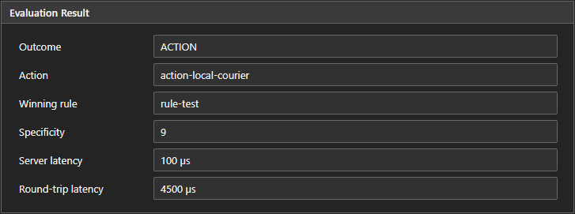
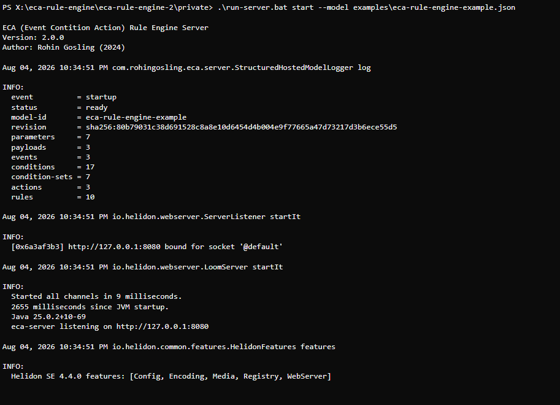
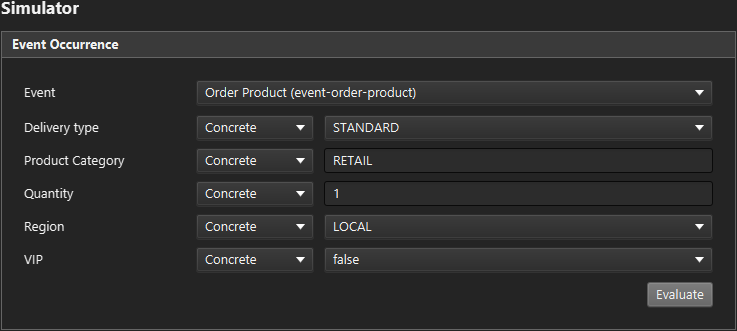
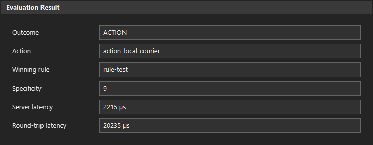

# ECA (Event Condition Action) Rule Engine


Domain independent, stateless **ECA Rule Engine** reference implementation, Version 2.0.0.<br>Companion implementation for the [Stateless ECA Rule Engine](docs/technical-note/stateless-eca-rule-engine.pdf) technical note.


<p align="center">
  
</p>


<p align="center">
  <strong>
    <a href="https://rohingosling.github.io/eca-rule-engine-2/">🌐 Try ECA Rule Engine Laboratory in your browser</a>
  </strong>
</p>
<p align="center">
  The web demo of <b>ECA Rule Engine Laboratory</b> will start with an emulated <b>ECA Rule Engine server</b> already running in the background, with the <code>eca-rule-engine-example.json</code> example model pre-loaded.<br>Equivalent to starting the real server with, <code>eca-server.exe start --model eca-rule-engine-example.json</code>.
</p>
<p align="center">
  In the web demo of <b>ECA Rule Engine Laboratory</b>, the quickest way to load the example model is to pull it directly from the demo server with <code>File -> Pull Model from Server</code>.
</p>
<a id="contents"></a>


## 📚 Contents

- [🔎 Overview](#overview)
- [🌐 Try the Demo Web Client](#web-client)
- [🚀 Windows Quick Start](#windows-quick-start)
- [🧩 Rule Model](#rule-model)
- [🖥️ ECA Rule Engine Laboratory - Desktop Client](#desktop-client)
- [⚙️ ECA Rule Engine Server](#server)
- [🔌 HTTP API](#http-api)
- [🛠️ Build and Run](#build-and-run)
- [📄 License](#license)

<a id="overview"></a>

## 🔎 Overview

This project implements a domain-independent, stateless, ECA (**E**vent **C**ondition **A**ction) rule engine reference solution that accompanies the [Stateless ECA Rule Engine](docs/technical-note/stateless-eca-rule-engine.pdf) technical note.

The solution consists of an **ECA** rule engine **server**, a desktop **client**, and a web version of the client with its own browser-local built-in server. **ECA Rule Engine Laboratory** can be used as both a standalone **ECA** model editor and a **simulator** for testing interaction with an **ECA** rule engine server.

<a id="web-client"></a>

## 🌐 Try the Demo Web Client

To quickly try out the client application, open [**ECA Rule Engine Laboratory**](https://rohingosling.github.io/eca-rule-engine-2/) in your browser to explore the model editor and validation workflow without installing Java or downloading the Windows executables.

The web demo of **ECA Rule Engine Laboratory** will start automatically connected to an emulated version of the **ECA Rule Engine server** running in the background, with the `eca-rule-engine-example.json` example model pre-loaded. Equivalent to executing the production server from a local Windows terminal with `eca-server.exe start --model eca-rule-engine-example.json`.

The web demo of **ECA Rule Engine Laboratory** looks and works exactly like the production desktop version, except for additionally supporting the emulated demo server. While you can also use the web demo to connect to a real remote server, the point of the web demo is to offer a quick and easy way to try out the application without the hassle of downloading `eca-server.exe`, running it, and then using `File -> Settings` in the client to connect to it. If you're going to run `eca-server.exe`, then it makes more sense to connect to it with the production client `eca-client.exe`.<br>*...See instructions for that below*.

**Example workflow**

1. open [**ECA Rule Engine Laboratory**](https://rohingosling.github.io/eca-rule-engine-2/) in your browser, and wait for `[Built-in Server] Ready with <model-name>` in the **Messages and Diagnostics** terminal.

2. Choose `File > Pull Model from Server`, then open the **Simulator** tab.

3. Select `event-order-product`. Set every displayed payload state to **Concrete**, using `STANDARD` delivery, `RETAIL` category, quantity `1`, `LOCAL` region, and VIP `false`.

   

4. Press the **Evaluate** button to obtain the `action-local-courier` ACTION result.

   

<a id="windows-quick-start"></a>

## 🚀 Windows Quick Start

The release consists of two Windows 11 x64 executables. Java, GraalVM, Maven, and a source checkout are not required to run them.

1. Install or update Microsoft's signed [Visual C++ v14 x64 Redistributable](https://aka.ms/vc14/vc_redist.x64.exe). Approve the one-time Windows elevation prompt and restart only if the Microsoft installer requests it.

2. Download both release files into a folder: [`eca-server.exe`](https://github.com/rohingosling/eca-rule-engine-2/releases/download/v2.0.0/eca-server.exe) and [`eca-client.exe`](https://github.com/rohingosling/eca-rule-engine-2/releases/download/v2.0.0/eca-client.exe).

3. Start the server, then the client:

   ```powershell
   .\eca-server.exe
   ```

   Leave that terminal open. Launch `eca-client.exe` directly by double-clicking it, or run it from a second terminal:

   ```powershell
   .\eca-client.exe
   ```

The Redistributable is required by both executables and is installed once for the machine. The ECA executables remain unsigned academic artifacts, so this Quick Start applies only where Windows security policy permits unsigned local applications. Windows may show an unrecognized-publisher warning; Smart App Control or an organization-managed Application Control policy can instead block them outright. This is an accepted limitation. Do not weaken the machine's security policy to run ECA.

GitHub automatically presents source code ZIP and tar archives for each release. The only project-supplied binary assets are `eca-server.exe` and `eca-client.exe`; their SHA-256 hashes and tag-build provenance appear in the release notes rather than in a third downloadable checksum file.

<a id="rule-model"></a>

## 🧩 Rule Model

The **ECA** rule engine **server** implements the following **ECA** rule model.

Each rule associates:

1. one event;
2. one conjunctive condition set; and
3. one action.

Reusable conditions own a parameter, an operator, and any required typed operands. Condition sets select those predefined conditions without redefining their values.

Supported condition operators are:

- equality and inequality;
- integer greater-than and less-than comparisons;
- inclusive and exclusive integer ranges; and
- `ANY`, an explicit wildcard matching concrete, present-null, and absent payload values.

Every matching non-`ANY` predicate contributes two specificity points. Every selected `ANY` predicate contributes one point, and an omitted condition contributes zero. The matching rule with greatest specificity wins; equal scores are resolved by the lexicographically smallest stable rule ID.

<a id="desktop-client"></a>

## 🖥️ ECA Rule Engine Laboratory - Desktop Client

**ECA Rule Engine Laboratory** is an SDI (Single Document Interface) JavaFX desktop client with the following features.

- ECA model editor.
- ECA model validation.
- ECA model simulator.
- Loading and saving ECA models to disk in JSON format.
- Ability to pull hosted models from the server, or push edited models to the server in real time.
- A context-aware `User Guide` panel that surfaces sections of the [Stateless ECA Rule Engine](docs/technical-note/stateless-eca-rule-engine.pdf) technical note relevant to the component being edited or studied in the editor.
- A message and diagnostics terminal.

The Simulator derives typed payload controls from the selected event. Every permitted payload property can be sent as a concrete value, explicit JSON `null`, or omitted property. Evaluation runs asynchronously and reports the outcome, selected action, winning rule, specificity, server and round-trip latency, and model revision. The client also shows whether the server revision matches the current local document.

<a id="play-with-the-example"></a>

### Play with the example - `eca-rule-engine-example.json`

1. Start the server in **PowerShell**, using the `--model` argument to load a model.

   For this step we are presuming you have a copy of the repo on your machine including the **examples** folder.

   ```powershell
   run-server.bat start --model examples\eca-rule-engine-example.json
   ```

   

2. Open a second **PowerShell** terminal, and start the client (**ECA Rule Engine Laboratory**) with `run-client.bat`. Keep the server running in the first terminal.

3. There are two ways to load a model into **ECA Rule Engine Laboratory**. You can load the model from **disk**, or you can pull the model from the running **server**.

   - **Load model from disk**

     From the `File → Open` menu in **ECA Rule Engine Laboratory**, load the **ECA** example model, `examples\eca-rule-engine-example.json`.

     ***Note:**<br>This will only work if you load the same model the server is hosting, `examples\eca-rule-engine-example.json` in the case of this example.*

   - **Pull the model being hosted by the server**

     Pull the model being hosted by the server into **ECA Rule Engine Laboratory** with `File → Pull Model from Server`.

     ***Note:**<br>This will only work if the server is hosting a model, for example if it was started with the `--model <file name>` argument, as in the case of this example.*

4. To test a query to the **server**, Select the  **Simulator** tab in **ECA Rule Engine Laboratory**, and setup the query as depicted in the figure below.

   
   

5. Press the `Evaluate` button to send the query to the **server**.

<a id="server"></a>

## ⚙️ ECA Rule Engine Server

The **ECA Rule Engine Server** uses Helidon, and can host at most one immutable model snapshot to expose a versioned JSON HTTP API for:

- Liveness and readiness.
- Model installation and retrieval.
- Occurrence evaluation.
- Authenticated graceful shutdown.

<a id="http-api"></a>

## 🔌 HTTP API

The server listens on `http://127.0.0.1:8080` by default. Its versioned JSON endpoints are:

| Method | Path | Purpose |
|---|---|---|
| `GET` | `/api/v1/health/live` | Report process liveness. |
| `GET` | `/api/v1/health/ready` | Report evaluation readiness and the active model revision. |
| `GET` | `/api/v1/model` | Download the active authoring model. |
| `PUT` | `/api/v1/model` | Validate and atomically replace the active model. |
| `POST` | `/api/v1/evaluations` | Evaluate one event occurrence. |
| `POST` | `/api/v1/management/stop` | Request graceful shutdown. |

Loopback use permits model reads and evaluations without a bearer token. Model replacement and graceful shutdown are protected; the server creates or reads the token file in its data directory. Use `eca-server.exe --help` and `eca-server.exe start --help` for the complete host, port, token-file, data-directory, request-limit, and startup-model options.

<a id="optional-browser-access"></a>

### Optional Browser Access

Cross-origin browser access is disabled by default. To let the experimental real-server target in the GitHub Pages application call the loopback server, allow that one exact origin and provide a high-entropy bearer token for Push. The following PowerShell workflow creates a 256-bit token in process memory, copies it to the clipboard without printing it, and starts the server without putting the token on the command line:

```powershell
$serverTokenBytes = [ byte [] ]::new ( 32 )
[ Security.Cryptography.RandomNumberGenerator ]::Fill ( $serverTokenBytes )
$env:ECA_SERVER_TOKEN = [ Convert ]::ToBase64String ( $serverTokenBytes )
$env:ECA_SERVER_TOKEN | Set-Clipboard
.\eca-server.exe start --model examples\eca-rule-engine-example.json --allowed-origin https://rohingosling.github.io
```

Paste the clipboard value into **Settings > Server > Bearer token** in the same browser page. The web client retains it only in page memory. Clear the clipboard after pasting, and clear `ECA_SERVER_TOKEN` after stopping the server. The browser will require an explicit Local Network Access permission grant. A denial or enterprise policy block is reported as blocked-or-unreachable and never disables the built-in demo server.

Repeat `--allowed-origin <origin>` only for another exact trusted HTTP(S) origin. Wildcards, `Origin: null`, URLs with paths, and arbitrary reflected origins are rejected. This option does not change the loopback bind, request limits, protected-operation authentication, or the requirement for trusted HTTPS when a server is exposed remotely.

<a id="build-and-run"></a>

## 🛠️ Build and Run

<a id="prerequisites"></a>

### Prerequisites

Running the two release executables requires Windows 11 x64 and the latest supported Microsoft Visual C++ v14 x64 Redistributable described in the [Windows Quick Start](#windows-quick-start).

Building from source additionally requires:

- JDK 25 for the complete Maven reactor and server work.
- JDK 17 or later for the JavaFX client-only workflow.
- Oracle GraalVM 25.0.4 for the native server, selected with `SERVER_GRAALVM_HOME`.
- Gluon GraalVM 22.1.0.1 with Java 17.0.3 for the native client, selected with `CLIENT_GRAALVM_HOME`.
- Visual Studio 2022 with the Desktop development with C++ workload and an x64 Windows SDK for native builds.

The Maven Wrapper is included; a separate Maven installation is not required.

<a id="jvm-verification"></a>

### JVM Verification

From the project root:

```powershell
build.bat
```

This runs the complete clean Maven verification reactor.

<a id="javafx-client"></a>

### JavaFX Client — ECA Rule Engine Laboratory

```powershell
run-client.bat
```

This builds the required Java 17-compatible modules and launches the client on the JVM.

<a id="native-executables"></a>

### Native Executables

```powershell
build-native.bat
```

The server build enables package-scoped exact reachability checking and both builds forbid fallback images. Checked-in reflection, resource, JNI, icon, and Windows version resources are covered by the JVM verification suite.

The native outputs are:

- `eca-server\target\eca-server.exe`
- `eca-client\target\gluonfx\x86_64-windows\eca-client.exe`

After building, run the independent native artifact and performance gates:

```powershell
verify-native.bat
```

On a Windows 11 development host with Windows Sandbox enabled, run the disposable clean-machine gate with:

```powershell
.\tools\native\verify-clean-windows-sandbox.ps1
```

If that Sandbox enforces a policy that rejects unsigned applications, retain the failure as environment evidence and do not disable the policy. Prepare the same hash-bound acceptance bundle for a separate clean VM whose existing policy permits unsigned local applications with:

```powershell
.\tools\native\verify-clean-windows-sandbox.ps1 -PrepareOnly
```

Copy the reported bundle directory into the VM and run the command printed by the script. The VM run remains open after completion so its exported evidence can be reviewed and copied back.

This verifies the following.

- x64 PE identity
- Version and icon resources
- Windows and approved Microsoft Visual C++ runtime import allowlists
- Centrally installed x64 runtime version, location, and Microsoft signatures
- SHA-256 checksums
- Isolated copy-one-file execution.
- The rendered JavaFX smoke path
- Server cold start
- Checks for 10,000-rule performance target
- Concurrent correctness
- Model-replacement availability
- Clean Windows 11 runtime installation and three-step launch acceptance

The verifier reports the measurements, checksums, and pass/fail status at completion.

Start the native server directly with:

```powershell
.\eca-server.exe
```

To validate, persist, and host a model as part of the same foreground startup:

```powershell
.\eca-server.exe start --model examples\eca-rule-engine-example.json
```

The server listens on `127.0.0.1:8080` by default.

<a id="license"></a>

## 📄 License

Released under the [MIT License](LICENSE) — Copyright © 2025 Rohin Gosling.
